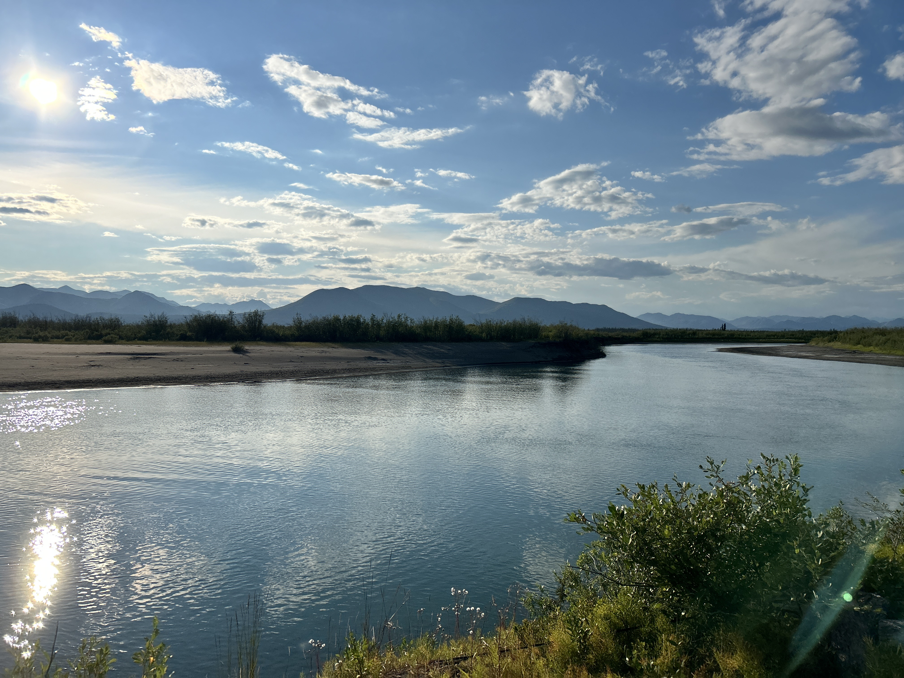

Matthew is passionate about understanding the connections between racial identity, land, and the environment. As a multiracial Latino with Indigenous ancestry, he’s particularly interested in what strengthens Indigenous identity, how land influences the way people think about race, and the broader impacts of settler colonialism. His research is grounded in both academic theory and community collaboration and utilizes quantitative and mixed-method approaches. He previously worked as a research fellow with the Indigenous Sentinels Network, where he traveled across Alaska to support ecological monitoring efforts with Alaskan Native communities. Matthew holds a B.A. in Sociology from California State University, San Bernardino, and is currently working on his Ph.D. at the University of Oregon. He’s also part of the [FireGeneration Collaborative](https://www.firegencollab.org/), where he continues to contribute to community-centered research. 
